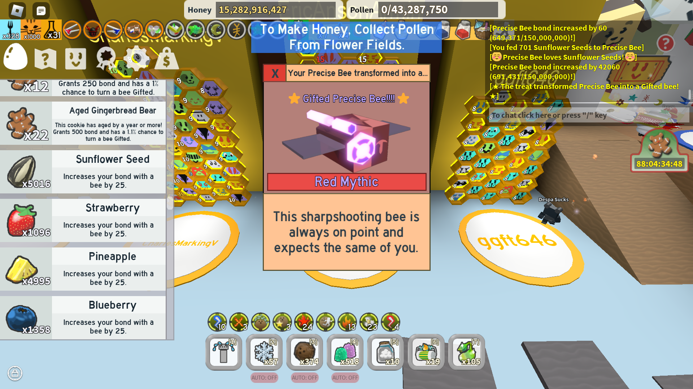

# testing
## smaller text

**bold text**
*italic text*

[this is a link to Markdown cheat sheet](https://www.markdownguide.org/cheat-sheet/)

[GitHub theme](https://pages.github.com/themes/)

1. this
2. way
3. is
4. a
5. much
6. bettere
7. way
8. to
9. make
10. a
11. list

---
this doesn't work :<
| table | number 1 | number 2 |
| name | random 1 | random 2 |
    
this is for fun

name new branch gh-pages allow the GitHub page to automatically set them as the webpage

_config.yml new file for theme
